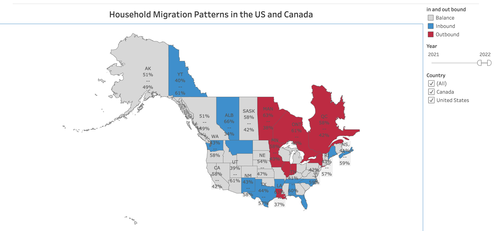

# Household Migration Patterns in the US and Canada: Where are people moving?

by: Victoire Migashane

  

---

# Project Description
In 2022, the Atlas® Van Lines study found that many Americans moved to places where more people were living. This is a change from before when people often moved to cheaper states. Now, other reasons like being closer to family are more important. I am trying to replicate the 2022 study for educational purposes.

# Project Goal
  * Answer the question "Where are most people moving".

# Initial Thoughts

# The Plan
    * Acquire data from [data.world](https://data.world/makeovermonday/2023w3)
    * Clean and analyse the data
    * Create interactive visuls with Tableau
    
  * Prepare data
    * Rename columns
    * No null values in the data
    * Change column data types
    * Save separete CSV
      
  * Explore the data
    * Answer the questions:
        - Which country have most people moving from/to?
        - What states/provence are most people moving from/to?

# Data Dictionary

| Column Name       | Description                                                                      |
|-------------------|----------------------------------------------------------------------------------|
| country           | The country where the migration data is recorded (e.g., "US" or "Canada").      |
| state_or_province | The specific state or province within the country where migration data is recorded. |
| year              | The year in which the migration data was collected.                               |
| inbound           | The number of households or people moving into the specified state or province during the given year. |
| outbound          | The number of households or people moving out of the specified state or province during the given year. |

# Steps to Reproduce
  * Clone this repo
  * Acquire the data from data.world
  * Run trough the readme notes

# Conclusions and take aways

    - People are moving  to the United States more than they are in Canada.
    - People are moving away from the United States more than they are in Canada.
    - Most people are moving away from Saskatchewan, Manitoba, and Ontario
    - Most americans are moving away from New York, Illinois, and Louisiana.
    - Most canadians are moving away from Saskatchewan, Manitoba, and Ontario.
    - Most people are moving to North Carolina, Idaho, and Tennessee.
    - Most canadians are moving to Newfoundland and Labrador, Nova Scotia, New Brunshwick.
    - Most americans are moving to North Carolina, Idaho, and Tennessee.
    
# Dashboard

